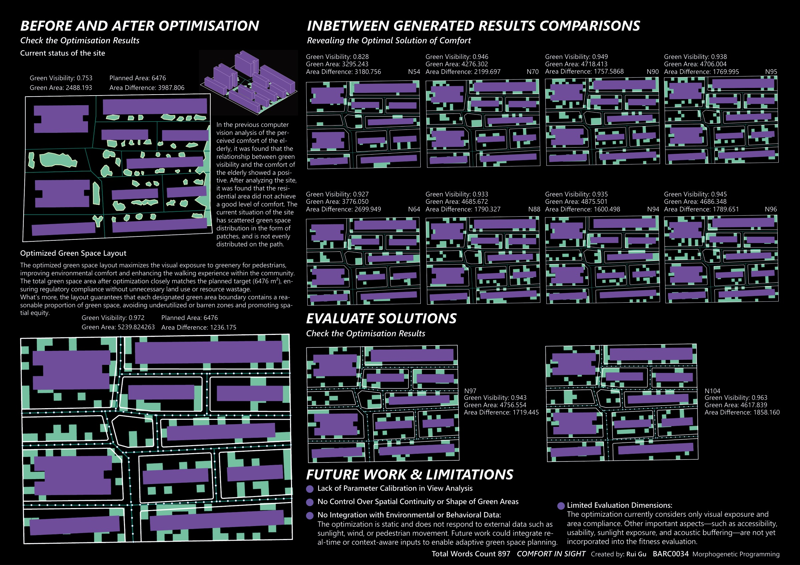
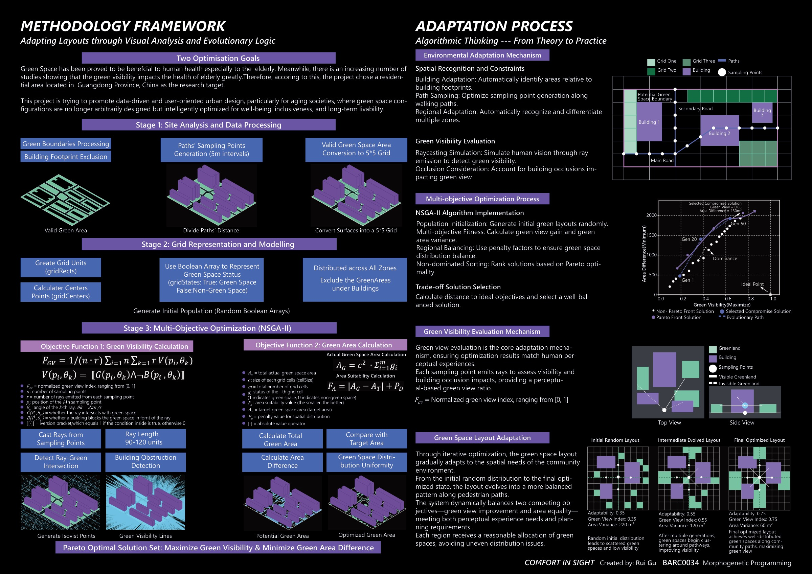
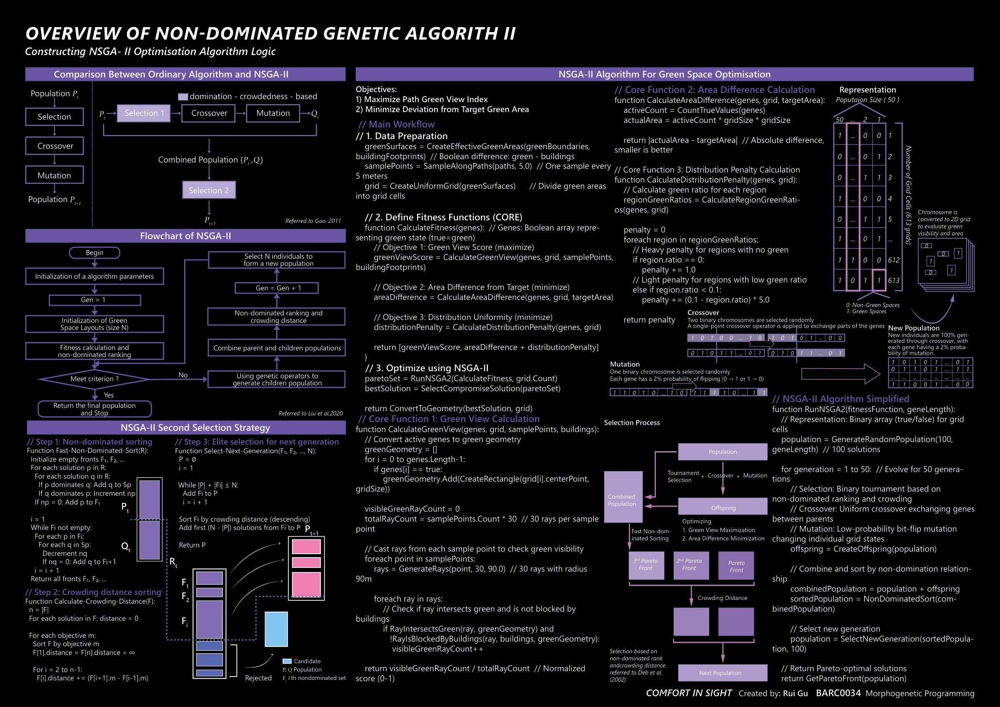

# Comfort in Sight

**Green space layout optimization using genetic algorithms**

Rui Gu · UCL Bartlett · Architectural Computation · BARC0034 Morphogenetic Programming

[中文说明](README.zh-CN.md) · [Project boards](MorphoGenetic.pdf) · [Source audit](docs/AUDIT.md)

This repository brings together the original Rhino/Grasshopper coursework, exported C# scripts, final submission materials, and a separate Python NSGA-II demonstration. The project explores green visibility and green area trade-offs for a residential site in Guangdong, China.

[](docs/images/results-board.jpg)

*Original project boards: site layouts before/after optimization and candidate comparisons. These are historical presentation outputs; the current Python demo uses a separate synthetic grid. [Open the full PDF](MorphoGenetic.pdf).*

## Visual walkthrough

### From site geometry to optimization

The original board connects boundary processing, building exclusion, path sampling and grid encoding to the two-objective spatial workflow.

[](docs/images/methodology-board.jpg)

<details>
<summary>Explore the original NSGA-II algorithm board</summary>

The algorithm board illustrates non-dominated sorting, selection, chromosome representation, crossover and mutation. See the source audit for the status of the exported implementation.

[](docs/images/algorithm-board.jpg)

</details>

*Previews are rendered from `Final_Project/Boards/Export/MorphoGenetic.pdf`. Click any image for the 2,400-pixel preview; [figure provenance](docs/images/README.md) records the source pages.*

## Start here

- **Understand the design:** read [MorphoGenetic.pdf](MorphoGenetic.pdf) or the [submitted boards](docs/boards/).
- **Run the Python demonstration:** follow the commands below. It uses a synthetic 5 × 6 grid and requires no Rhino or GPU.
- **Inspect the final spatial project:** use [grasshopper/final-submission/](grasshopper/final-submission/) together with its Rhino model.
- **Read the C# implementation:** start at [00_NSGA-II](src/grasshopper/00_NSGA-II/). These are historical script exports with known defects, not a verified standalone application.

## Two distinct implementations

| Property | Rhino / Grasshopper / C# coursework | Python demonstration |
| --- | --- | --- |
| Geometry | Site boundaries, buildings, paths and candidate green cells | Synthetic rectangular grid; no site geometry |
| Representation | Boolean chromosome over generated cells | Continuous values thresholded at `x > 0.5` |
| Objectives | Maximize ray-based green visibility; minimize area deviation plus regional penalty | Minimize four objectives listed below |
| Defaults in source | Population 100; 50 generations; 5-unit cells; target area 6,476; 30 rays; ray radius 100 | Population 100; 300 generations; seed 1; 30 cells; 6 columns; 3 regions; target ratio 0.5 |
| Algorithm | Custom C# NSGA-II implementation | `pymoo.NSGA2(pop_size=100)` with default continuous operators |
| Status | Archived coursework; sorting failure reproduced in extracted optimizer classes | Full default run checked locally; see audit |

The C# defaults describe `src/grasshopper/00_NSGA-II/C_-1f522.cs`. Settings embedded in individual GH files and diagrams may differ. The Python script is an algorithm demonstration, **not a reproduction of the site's Green View Index**.

## Python objectives

All four objectives are minimized. Let `g = x > 0.5`, and let `r` be the fraction of active green cells:

1. **Coverage:** `f1 = -r`.
2. **Target ratio deviation:** `f2 = abs(r - 0.5)` with the default target.
3. **Regional unevenness:** `f3 = sum(abs(region_green_ratio - r))` across three contiguous index regions. These are synthetic regions, not imported site boundaries.
4. **Isolated cell rate:** `f4 = isolated_green_cells / n_cells`, using north/south/east/west neighbors. This penalizes individual isolated cells; it does not guarantee a single connected green patch.

The script selects a compromise by min-max normalizing the returned objective vectors and minimizing Euclidean distance to the origin. It prints objective values and an emoji grid. It does not save layouts, plots, CAD geometry or a results dataset.

## Run the Python demonstration

Validated environment: **Python 3.10, NumPy 2.2.6, pymoo 0.6.1.6**. The requirements file pins direct dependencies; transitive packages are resolved by pip.

```bash
git clone https://github.com/gurui7913/AC_GreenSpaceOptimization.git
cd AC_GreenSpaceOptimization
python -m venv .venv
```

Activate the environment:

```powershell
# Windows PowerShell
.\.venv\Scripts\Activate.ps1
$env:PYTHONIOENCODING = "utf-8"
```

```bash
# macOS / Linux
source .venv/bin/activate
export PYTHONIOENCODING=utf-8
```

Then run:

```bash
python -m pip install -r requirements.txt
python "NSGA-II based green space optimization.py"
```

If PowerShell blocks environment activation, call `.\.venv\Scripts\python.exe` directly. UTF-8 output is needed for the emoji layout on terminals using legacy encodings.

Configuration is currently edited inside the script; there are no command-line options. Its final layout reshape and printed denominator are hard-coded to 5 × 6 and 30. Keep the default dimensions unless you also update those statements. Importing the script starts optimization because it has top-level execution code.

## Inspect the Grasshopper project

1. In Rhino with Grasshopper, open `grasshopper/final-submission/Morpho_Project.3dm`.
2. Open `OptimizeGreenlandLayout_C#.gh` from the same directory.
3. Inspect geometry references, document units, script inputs and component errors before enabling optimization. Rebind referenced curves if necessary.
4. Compare the definition with the exported scripts and [audit](docs/AUDIT.md). This archive has not been executed or geometry-validated in Rhino during the organization pass.

The submitted `OptimizeGreenlandLayout_C#.gh` and `OptimizeGreenlandLayout_ResultGenerated.gh` are byte-identical; the latter name does not establish that it contains a separate generated result. The older published `GreenSpaceOptimization_GH/` bundle is retained at its original path. Its files differ from the final submission and should be kept with their corresponding models.

Exported `.csproj` files preserve historical machine-specific Rhino assembly paths and `net452` / C# 5 settings. They require local configuration and, in some folders, incompatible or incomplete script exports. There is no verified one-command C# build. Wallacei-related experiments in the local thesis archive are separate from the custom C# optimizer included here.

## Repository layout

```text
AC_GreenSpaceOptimization/
├── README.md / README.zh-CN.md
├── requirements.txt
├── NSGA-II based green space optimization.py  # Original published Python demo
├── GreenSpaceOptimization_GH/                # Original published GH/model pair
├── grasshopper/final-submission/             # Submitted GH/model pair and duplicate export
├── src/grasshopper/                          # Original C# source/project exports
│   ├── 00_DataProcessing/
│   ├── 00_GeneticAlgorithm/                   # Incomplete experimental draft
│   ├── 00_NSGA-II/                           # Main export plus empty wrapper
│   ├── 01_FO1/
│   ├── 02_Visualization/
│   └── 11/                                  # Alternate historical optimizer export
├── coursework/A1/ ... A4/                    # Student definitions; A1 also has C# source
├── MorphoGenetic.pdf                         # Original published combined boards
└── docs/
    ├── AUDIT.md
    ├── source-map.csv                       # Original relative paths and SHA-256
    ├── boards/
    ├── presentations/
    └── images/
```

## Results and limitations

The boards contain historical design outputs and illustrations. This repository does not include a machine-readable real-site evaluation log that establishes repeatable improvement percentages or planning compliance. The earlier README's `+28%` visibility and `+20%` efficiency claims are therefore not carried forward as verified results.

The Python demo optimizes coverage rather than visibility, uses no building occlusion or physical cell area, and cannot validate the real-site claims. Its returned continuous solutions can also decode to repeated binary layouts. Known C# sorting, crowding-distance and build issues are recorded in [docs/AUDIT.md](docs/AUDIT.md); the organization pass preserves algorithm source bytes.

## Archive policy

The local assignment folder retains instructor briefs, thesis material, third-party tutorials, large editable design files, older iterations, backups and IDE caches. The GitHub repository contains selected student code and final project deliverables. [Source map](docs/source-map.csv) records the provenance of imported and matched existing assets. No new license is assigned in this organization pass.
